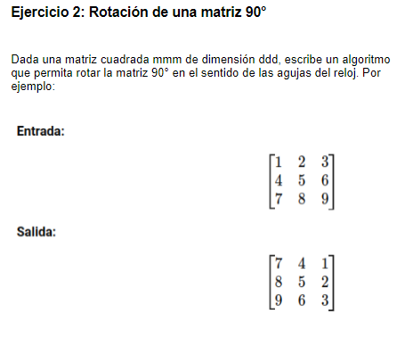

# 1. Formulación del problema

<p align="center">
  
</p>

# 2. Resolución

> I) Entrada del valor de la variable "dimension"

```bash
import java.util.Scanner;
```

```bash
    public static void main(String[] args) {
    System.out.println("Ingresar dimension [d]: ");
    int d = sc.nextInt();
    if(d <= 0){
        d = sc.nextInt();;
    }
```
> II) Ingreso de numeros enteros en la matriz en un rotación especifica 

```bash
    Rotar(d);
```

```bash
    public static void Rotar(int d){
    Scanner sc = new Scanner(System.in);    
    int[][] Matriz = new int[d][d];
    
    
    for(int i=0; i < d; i++){
        for(int j=0; j < d;j++){
            System.out.print("["+i+"]"+"[" + j+"]");
            Matriz[j][d - i - 1] = sc.nextInt();           
        }
    }
```

> III) Impresión de la matriz cuadrada original y la matriz cuadrada rotada

```bash
    System.out.println("MATRIZ ORIGINAL: ");
    for(int i=0; i < d; i++){
        for(int j=0; j < d;j++){
            System.out.print("["+Matriz[j][d - i - 1]+"]");        
        }
    System.out.println("");    
    }
    
    System.out.println("MATRIZ ROTADA: ");
    for(int i=0; i < d; i++){
        for(int j=0; j < d;j++){
            System.out.print("["+Matriz[i][j]+"]");        
        }
    System.out.println("");    
    }
    }
```

### Codigo completo

```bash
import java.util.Scanner;

public class Main {

    public static void Rotar(int d){
    Scanner sc = new Scanner(System.in);    
    int[][] Matriz = new int[d][d];
    
    
    for(int i=0; i < d; i++){
        for(int j=0; j < d;j++){
            System.out.print("["+i+"]"+"[" + j+"]");
            Matriz[j][d - i - 1] = sc.nextInt();           
        }
    }

    System.out.println("MATRIZ ORIGINAL: ");
    for(int i=0; i < d; i++){
        for(int j=0; j < d;j++){
            System.out.print("["+Matriz[j][d - i - 1]+"]");        
        }
    System.out.println("");    
    }
    
    System.out.println("MATRIZ ROTADA: ");
    for(int i=0; i < d; i++){
        for(int j=0; j < d;j++){
            System.out.print("["+Matriz[i][j]+"]");        
        }
    System.out.println("");    
    }
    }

    
    public static void main(String[] args) {
    System.out.println("Ingresar dimension [d]: ");
    int d = sc.nextInt();
    if(d <= 0){
        d = sc.nextInt();;
    }
    
    Rotar(d);
        
         
    }
    
}
```
# 3. Complejidad


